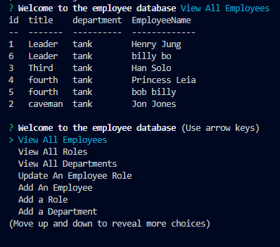

# Employee Database 

  

  This is a homework assignment which required us to create a CLI employee database which lets you view and add employees.

  ## Table of Contents
  * [Screenshot](#Screenshot)
  * [Gif](#Gif) 
  * [Video](#Video)
  * [Installation](#installation)
  * [Usage](#usage)
  * [License](#license)
  * [Contributing](#contributing)
  * [Tests](#tests)

  ## Screenshot 

  

  ## Gif

  

  ## Video

  https://drive.google.com/file/d/1E7pK5HXn-6lriKMn3lmMm1nUUkrHbHfM/view
  
  ## Installation

  clone the repo, npm i, node index.js.

  ## Usage

  use your arrow keys to navigate the list of available functions and hit enter key to select them.

  ## License

  Apache

  ## Contributing

  Please email for contributions.

  ## Tests

  There are no available tests for this project.

  Find me on Github at: [henryrjung](https://github.com/henryrjung)

  You can also send me an email with any questions at: henryjung667@gmail.com